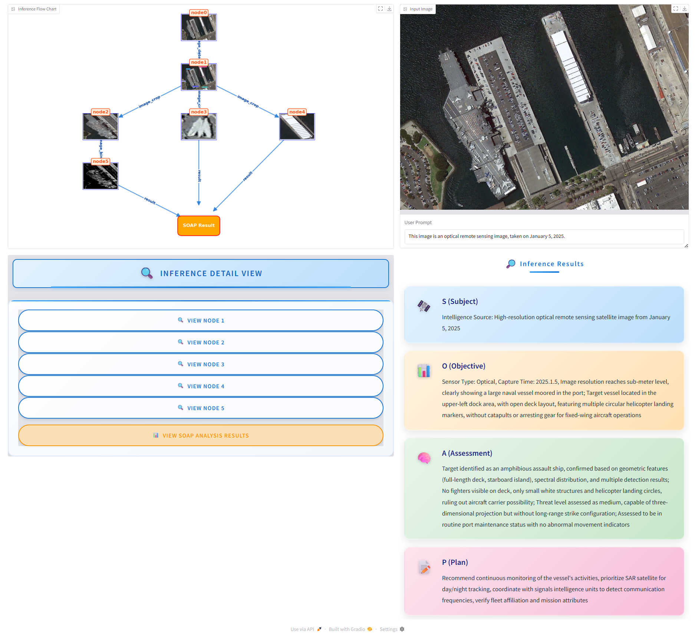

# Multi-Modal Reasoning Agent Framework

This repository contains the core components for a multi-modal reasoning agent system. The system is designed to support multi-round vision-language reasoning tasks, dataset construction, and modular tool invocation using a Model Context Protocol (MCP)-based architecture.

## 📁 Project Structure

```text
gist/
├── client/
│ ├── chat_client.py # Agent interaction and reasoning interface via gradio
│ ├── create_dataset_client.py # Agent to generate datasets with multi-modal reasoning traces
│ ├── dataset_prompt.py # Prompt construction logic generation (en)
│ └── dataset_prompt_zh_hans.py # Prompt construction logic generation (zh_hans)
│
├── server/
│ ├── mcp_search_server.py # MCP search tool server
│ ├── mcp_vision_server_chat.py # MCP vision server for chat reasoning
│ ├── mcp_vision_server.py # MCP vision server for dataset reasoning
│ ├── vision_prompt.py # Prompt templates and logic for vision models (en)
│ └── vision_prompt_zh_hans.py # Prompt templates and logic for vision models (zh_hans)
│
├── utils/
│ └── vlm_utils.py # Utilities for handling vision-language model
│
└── README.md # Project documentation
```

## 🚀 Features

- Modular client-server architecture with plug-and-play tool design
- MCP protocol-based tool invocation
- Multi-turn visual reasoning with traceable stack memory
- Dataset creation for fine-tuning or evaluation
- Compatible with vision-language models (e.g., OpenFlamingo, Qwen-VL)

## 🧩 Usage
### Launch interactive agent client
```bash
python client/chat_client.py
```
### Create dataset samples:
```bash
python client/create_dataset_client.py
```

## ⚠️ **Warning**

- This repository is still under active development.  
- Several essential components are not included directly in this repo.

> You **must manually install and configure** the following dependencies before running the full pipeline:

- [GroundingDINO](https://github.com/IDEA-Research/GroundingDINO) – for object grounding and region proposal
- [Restormer](https://github.com/swz30/Restormer) – for image restoration and enhancement
- [Real-ESRGAN](https://github.com/xinntao/Real-ESRGAN) – for image super-resolution

> These models require additional setup, including downloading pretrained weights.  
> Please refer to their respective repositories for detailed installation instructions.  
> Please check your network environment before running the agent.

## 🧪 Demo



查看上方图片或 [点击此处](https://github.com/AAAnonymous1/VE-CoT/releases/tag/v0.0.1) 下载演示视频。